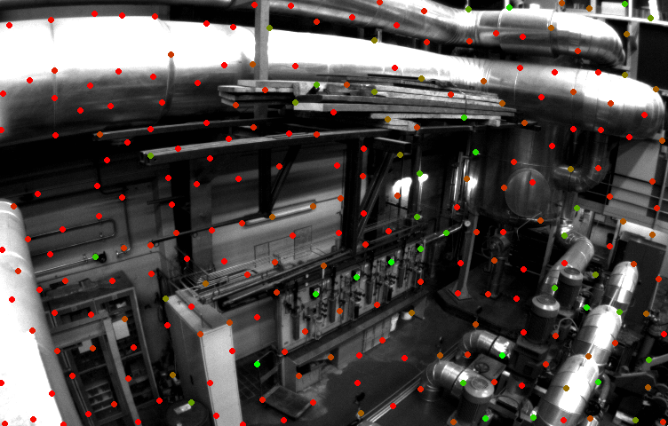

OpenCV Good Features To Track with Scores
=========================================

This code returns a `std::vector<float>` of detection scores from `cv::goodFeaturesToTrack`.

An interactive example is provided. Use `+`/`-` keys to choose the `n`-th greatest feature score to normalize by. Below is shown with `n=1`.

<p align="center">
	
</p>

## Background

Under the hood, `cv::goodFeaturesToTrack` runs the following core code:

```c++
if( useHarrisDetector )
    cornerHarris( image, eig, blockSize, gradientSize, harrisK );
else
    cornerMinEigenVal( image, eig, blockSize, gradientSize );

double maxVal = 0;
minMaxLoc( eig, 0, &maxVal, 0, 0, _mask );
threshold( eig, eig, maxVal*qualityLevel, 0, THRESH_TOZERO );
dilate( eig, tmp, Mat());

// ...

std::sort( tmpCorners.begin(), tmpCorners.end(), greaterThanPtr() );
```

This code first calculates the minimum eigenvalue of the gradient each block (i.e., 3x3 neighborhood of image), as required for finding a [Shi-Tomasi / Harris corner](https://docs.opencv.org/3.0-beta/doc/py_tutorials/py_feature2d/py_shi_tomasi/py_shi_tomasi.html). If this minimum eigenvalue is above some threshold, then the pixel where the block was centered is considered as a feature. Note that the magnitude of an eigenvalue corresponds with how good of a feature that pixel is.

However, since a desired `qualityLevel` was requested, the next block of code thresholds every eigenvalue response below `maxVal*qualityLevel` to 0, where `maxVal` is the *greatest* minimum eigenvalue from the entire image.

Since there are only so many features that can be selected (`maxCorners`), the next code block then sorts the features by their associated eigenvalue response.
